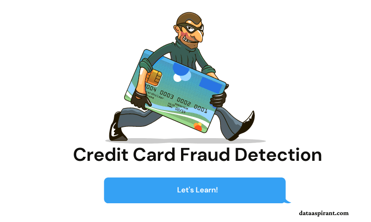

# Credit Card Fraud Detection Web App

This repository contains the procedure we followed to deploy our web app of Credit Card Fraud detection on Heroku.

Since the data for credit card fraud is not available in real form(due to confidentiality), and is availbale only in dimensionality reduced form, we will be sharing some of the test cases here.

### Web App Production

- Procfile
  - Contains the type of app.
- Requirements
  - Libraries needed to run the app.
- Templates
  - Files required for rendering purpose
- Static
  - CSS styles
- App
  - Main file which will run our Web App.

---

<!-- ## Report

A thorough report on what we did can be found in *_FinalReport.md_* or *_FinalReport.pdf_* file.

**** -->

## Test Data for Fraud Transaction:

Testing data for fraud transaction can be found in the **_"fraud_values.csv"_** file.

---

## Test Data for Valid Transaction:

Testing data for a Valid transaction can be found in the **_"valid_values.csv"_** file.

---

## Web App

Our Credit Card Fraud Detection web app is available at: [Credit Card Fraud Detection](https://www.google.com/url?q=https://credit-card-fraud-detect-ion.herokuapp.com/&sa=D&source=hangouts&ust=1599890506172000&usg=AFQjCNFMw5kRvTCqhn-xm35d7hSq0sooYQ)
